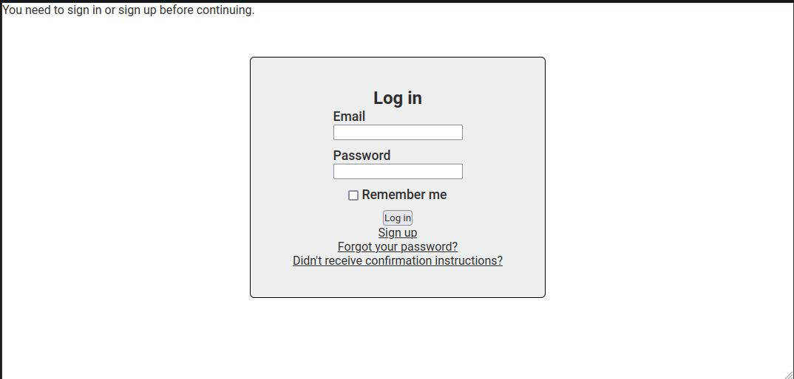

# Recipe app

> The Recipe app keeps track of all your recipes, ingredients. It will allow you to save ingredients, keep track of what you have, create recipes, and generate a shopping list based on what you have and what you are missing from a recipe. Also, since sharing recipes is an important part of cooking the app should allow you to make them public so anyone can access them.


### Preview



## Built With

- _**Ruby**_
- _**Rails**_
- _**PostgreSQL**_

## Getting Started

### Clone this repository

```bash
$ git@github.com:Nicolaswg/Rails-recipe-app.git
$ cd Rails-recipe-app
```
### Install gems
```bash
$ bundle install
```

### Setup database
```bash
$ rails db:create
$ rails db:migrate
```

### Start server
```bash
$ rails s
```
Open http://localhost:3000/ in your browser

### Run tests
```bash
$ bundle exec rspec
```

## Authors

👤 **Sahar Abdel Samad**

- GitHub: [@sahar-abdelsamad](https://github.com/Sahar-AbdelSamad)
- Twitter: [@abdelsamadsahar](https://twitter.com/AbdelSamadSahar)
- LinkedIn: [sahar-abdel-samad](https://www.linkedin.com/in/sahar-abdel-samad/)

👤 **Nicolas Gonzalez**

- GitHub: [@Nicolaswg](https://github.com/Nicolaswg)
- Twitter: [@Nicolas54146830](https://twitter.com/Nicolas54146830)
- LinkedIn: [nicolas-gonzalez](https://www.linkedin.com/in/nicolas-gonzalez-8623461a0/)

## 🤝 Contributing

Contributions, issues, and feature requests are welcome!

## Show your support

Give a ⭐️ if you like this project!
